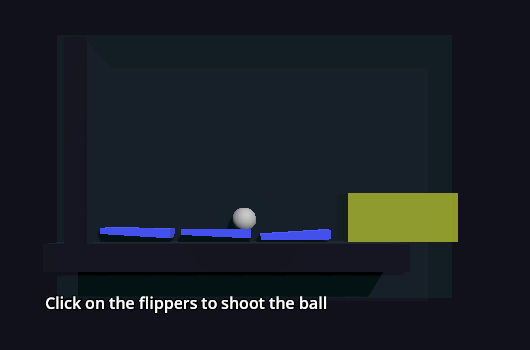
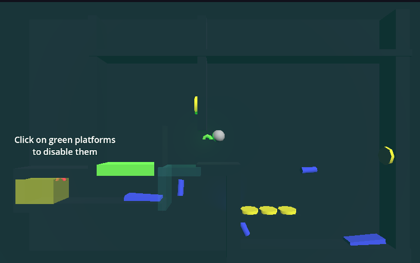
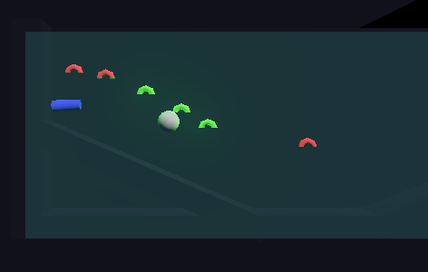

# Freeform pinball
please ignore the fact that the repo says pinball
its a mistake on my part.

Made with godot for hack club flavortown.
A little platformer game where you move a ball
by moving everything but the ball.

Made in godot 3.5.1, I don't like using blender
so practically all of the game is made using CSG
shapes.

# Screenshots

# Run it

get it on [itch](https://andres-dev.itch.io/freeform-pinball)

I didn't make a web version because I fear the godot web renderer
will not be friendly with the game's transparent surfaces.
Mostly glass that goes on 2D levels so the ball doesn't fall out.

# Controls?

You should be explained everything by the game itself.
However, in any case.
Move the camera: Hold right click
Interact with things: click them
pause: escape
Shoot canons: click on target

# System requierements.
Practically any PC. Though it should have vulkan support.
(This means any PC these days.)

